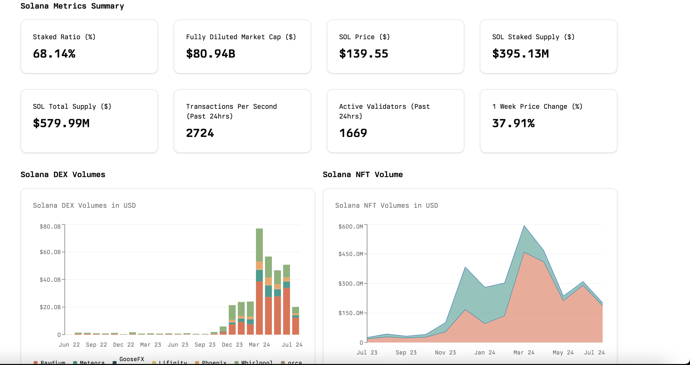

# Solana Metrics Dashboard

This project is a React application that visualizes the a summary of solana metrics such as SOL Price, FDV, SOL stake supply, total validators, SOL Total Supply, Active validators, trading volumes of Solana DEXs and NFTs as well as . It uses the `recharts` library to create interactive and responsive charts, and TypeScript for type safety. The data for the charts is fetched and processed to show the volumes in a user-friendly format.

## Table of Contents

- [App Screenshot](#screenshot)
- [Features](#features)
- [Demo](#app-demo)
- [Getting Started](#getting-started)
  - [Prerequisites](#prerequisites)
  - [Installation](#installation)
  - [Running the App](#running-the-app)
- [Tech Stack](#tech-stack)
- [License](#license)

## App Screenshot



## Features

- Visualizes a summary of Solana metrics such as  SOL Price, FDV, SOL stake supply, total validators, SOL Total Supply, Active validators
- Visualizes Solana DEX trading volumes.
- Visualizes Solana NFT trading volumes.
- Interactive charts with tooltips, legends, and formatted axes.
- Interactive table displaying Solana DEX Pair Volume Stats 

## Demo


## Getting Started

### Prerequisites

Before you begin, ensure you have the following installed:

- [Node.js](https://nodejs.org/en/download/) (version 14 or later)
- [npm](https://www.npmjs.com/get-npm) or [yarn](https://yarnpkg.com/getting-started/install)

### Installation

1. Installing the app locally:

 ```bash
   git clone https://github.com/DennohKim/superteam-submission.git
   cd superteam-submission
   npm i
   ```


### Running the App 

First, run the development server:

```bash
npm run dev
# or
yarn dev
# or
pnpm dev
# or
bun dev
```

Open [http://localhost:3000](http://localhost:3000) with your browser to see the result.

## Tech Stack

- [Dune Analytics API](https://dune.com/product/api)
- [Recharts](https://recharts.org/)
- [React](https://react.dev/)
- [NextJS](https://nextjs.org/)
- [Shadcn UI](https://ui.shadcn.com/)


## License

See the [LICENSE](LICENSE.md) file for license rights and limitations (MIT).


